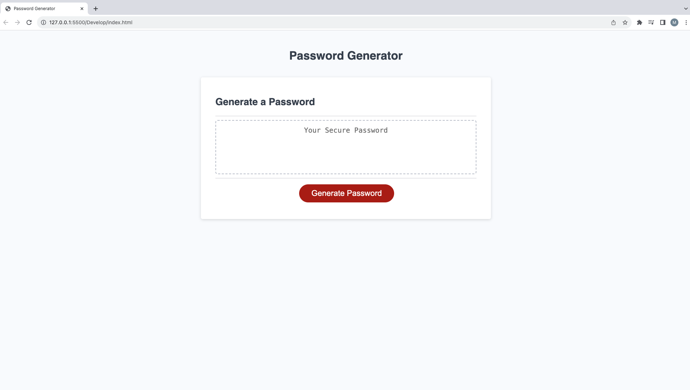

# passwordGenerator
Third Challenge
-AS AN employee with access to sensitive data.
I WANT to generate a password that meets certain criteria.
SO THAT I can create a strong password (providing greater security).

-AS User I want generate a strong [random] password that follows a set of parameters to ensure security.
When I click the “generate password” button,
THEN I am prompted to provide answers to set the parameters for the passsword that will be randomly generated for me. 
WHEN I am presented with the first prompt for length (with the length option being between 8 and 128 characters), I type in a number.
THEN I am presented with different prompts for character types to include in the password. The prompts give the option to include lowercase letters, uppercase letters, numbers, and special characters.
IF any of the answers above are not within the given parameters, an alert will be displayed on the page to inform you of your mistake BEFORE moving on to the next prompt
IT is done when a random password is generated following the previously selected criteria. 

## Screenshot

